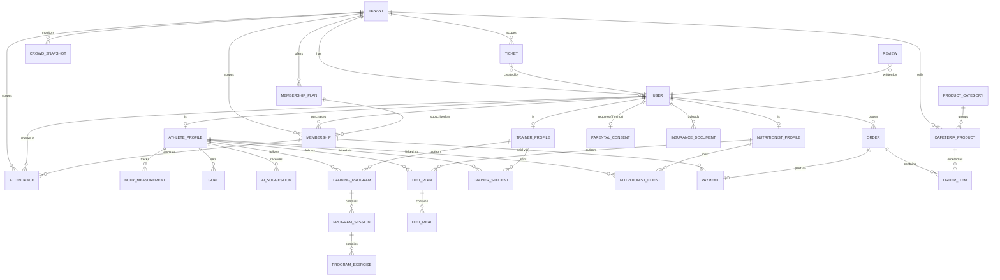

# طراحی پایگاه‌داده گُردیار — سامانه هوشمند ورزش ایران

## استراتژی Multi-Tenant

**Shared Database, Shared Schema, tenant_id discriminator.**

- هر جدول تننت‌محور یک ستون `tenantId` دارد (به جز `User` که برای `SUPER_ADMIN` می‌تواند `null` باشد).
- ایزولاسیون داده در دو لایه تضمین می‌شود:
  1. **لایه اپلیکیشن (اصلی):** یک `TenantContextMiddleware` در NestJS، `tenantId` را از JWT استخراج کرده و در یک `REQUEST`-scoped provider قرار می‌دهد. تمام Repository/Service ها از طریق یک `PrismaService` پوشش‌دار (wrapped) کار می‌کنند که `tenantId` را به صورت خودکار به هر کوئری (`WHERE`, `create`, `findMany`, ...) تزریق می‌کند — منطق tenant filtering هرگز دستی در هر endpoint نوشته نمی‌شود.
  2. **لایه دیتابیس (دفاع لایه دوم):** PostgreSQL Row-Level Security (RLS) روی تمام جداول تننت‌محور فعال می‌شود. اتصال دیتابیس از طریق یک نقش (role) محدود برقرار می‌شود که `current_setting('app.tenant_id')` را در ابتدای هر تراکنش ست می‌کند. حتی در صورت باگ در لایه اپلیکیشن، دیتابیس به‌خودی‌خود رکوردهای تننت دیگر را برنمی‌گرداند.

نمونه DDL برای RLS (به ازای هر جدول تننت‌محور تکرار می‌شود):

```sql
ALTER TABLE "Attendance" ENABLE ROW LEVEL SECURITY;

CREATE POLICY tenant_isolation_attendance ON "Attendance"
  USING ("tenantId" = current_setting('app.tenant_id', true)::text);
```

و در ابتدای هر تراکنش Prisma:

```sql
SET LOCAL app.tenant_id = '<tenant-uuid>';
```

`SUPER_ADMIN` از یک role دیتابیسی جدا (bypass RLS) برای گزارش‌های پلتفرمی استفاده می‌کند، نه از role عمومی اپ.

## چرا Shared-DB به‌جای Schema/DB-per-tenant؟

- هزینه عملیاتی پایین‌تر (یک connection pool، یک migration pipeline).
- مقیاس‌پذیری افقی ساده‌تر برای هزاران باشگاه کوچک/متوسط (مدل غالب این پلتفرم).
- ایندکس‌گذاری مرکب `(tenantId, ...)` روی تمام جداول پرتراکنش (Attendance، Order، Payment، AuditLog) عملکرد کوئری را در سطح هر تننت تضمین می‌کند.
- اگر در آینده باشگاه‌های Enterprise با نیاز ایزولاسیون سخت‌گیرانه‌تر وارد شدند، می‌توان آن‌ها را به‌صورت انتخابی به schema-per-tenant مهاجرت داد؛ معماری فعلی این مهاجرت را مسدود نمی‌کند.

## نکات کلیدی مدل داده

- **سن و رضایت والدین:** `User.dateOfBirth` ذخیره می‌شود؛ `isMinor` و `isRestricted` در زمان ثبت‌نام توسط سرویس بک‌اند محاسبه و ست می‌شوند (هرگز از کلاینت دریافت نمی‌شوند). تا تایید `ParentalConsent`، `isRestricted = true` باقی می‌ماند و Guard های RBAC دسترسی را مسدود می‌کنند.
- **بیمه ورزشی:** `InsuranceDocument.status` گیت فعال‌سازی کامل `Membership` است؛ منطق در سرویس Membership بررسی می‌شود نه به‌صورت یک constraint دیتابیسی (چون نیاز به پیام خطای کاربرپسند فارسی دارد).
- **خروجی AI Engine:** در `AISuggestion.outputJson` به‌صورت JSON ساختاریافته ذخیره می‌شود (قرارداد دقیق در سند API). `status` چرخه `GENERATED → EDITED → APPROVED/REJECTED` را دنبال می‌کند تا قابلیت ردیابی (auditability) کامل باشد؛ هیچ پیشنهاد AI مستقیماً به برنامه نهایی athlete تبدیل نمی‌شود بدون عبور از این چرخه.
- **تایید مربی در برابر تایید متخصص تغذیه:** عمداً دو مدل پروفایل و دو enum وضعیت جدا (`TrainerProfile.status` تایید توسط Gym Owner، `NutritionistProfile.status` تایید *فقط* توسط Super Admin) — این تفاوت سطح تایید را در سطح schema و نه فقط منطق اپلیکیشن صریح می‌کند.
- **ازدحام لحظه‌ای (Crowd Monitoring):** به‌جای محاسبه live از روی `Attendance` در هر درخواست، یک job زمان‌بندی‌شده (هر ۳۰-۶۰ ثانیه) تعداد فعال را می‌شمارد، در `CrowdSnapshot` می‌نویسد و از طریق Redis Pub/Sub + WebSocket Gateway broadcast می‌کند. این هم بار دیتابیس را کم می‌کند و هم داده تاریخی برای نمودار ساعات اوج فراهم می‌کند.

## ER Diagram (Mermaid)



## فایل‌های مرتبط

- `schema.prisma` — اسکیمای کامل Prisma (۳۵+ مدل) آماده برای `prisma migrate dev`.
- مرحله بعدی پیشنهادی: اسکلت بک‌اند NestJS با `TenantContextMiddleware`، `PrismaService` پوشش‌دار، RBAC Guards مبتنی بر `Role` enum، و ماژول Auth (JWT + Refresh Token).
